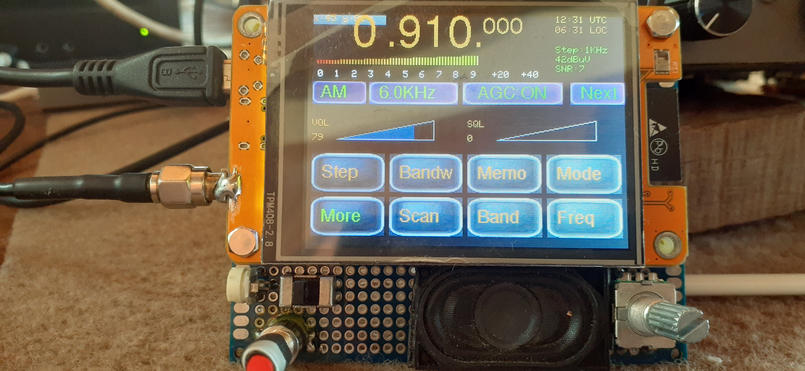

# CYD-receiver-with-SI4732-
A 0.15-30MHz receiver, based on the popular CYD (cheap yellow display). This receiver uses the firmware for SI4732-receivers from my other repo, adapted for the touch controller and GPIO's of the ESP32-2432S028 CYD. 

